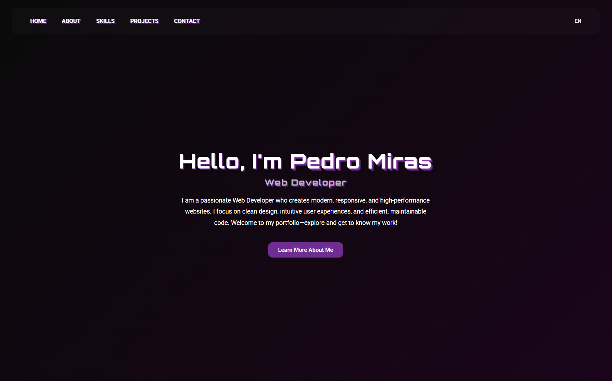

# 👨‍💻 Pedro Miras - Web Developer Portfolio



Welcome to my personal portfolio repository. This project showcases my skills, projects, and experience as a Web Developer. It is built with a focus on modern UI/UX trends, performance, and clean code.

🔗 **Live Demo:** [Ver Portfolio Online](https://pedromiras.github.io/)

---

## 🚀 Key Features

* **Modern Design:** Dark theme with Neon accents and **Glassmorphism** effects using CSS backdrop-filters.
* **Immersive Navigation:** Full-screen sectioning with **CSS Scroll Snap** for a smooth browsing experience.
* **Responsive & Adaptive:** Fully responsive layout with a custom mobile navigation menu (horizontal scroll/multiline) designed for all devices.
* **Interactive UI:** 3D text effects, hover animations, and dynamic elements.
* **Functionality:**
  * **Multi-language Support:** Integrated **Google Translate API** for automatic English/Spanish translation with a custom toggle button.
  * **Working Contact Form:** Fully functional form integrated with **EmailJS** service.
  * **Project Showcase:** Direct links to live demos and source code for sub-projects like the Ducati Landing Page and Todo App.

---

## 🛠️ Technologies Used

This project is built using pure **Vanilla Web Technologies** to demonstrate a strong understanding of the fundamentals.

* **HTML5:** Semantic structure and accessibility.
* **CSS3:**
  * CSS Variables (Custom Properties) for efficient theming.
  * Flexbox & CSS Grid for advanced layouts.
  * Centralized Media Queries for maintainable responsiveness.
  * Animations & Transitions (Keyframes, Hover effects).
* **JavaScript (ES6+):**
  * DOM Manipulation.
  * Logic for custom navigation, scroll handling, and sticky headers.
  * **Integration with external APIs:**
    * [EmailJS](https://www.emailjs.com/) (Contact Form).
    * [Google Translate API](https://cloud.google.com/translate) (Localization/Internationalization).
* **External Libraries:**
  * [FontAwesome](https://fontawesome.com/) (Icons)

---

## 📂 Project Structure

```text
/
├── assets/          # Images, icons, and static assets
├── css/             # Stylesheets (Modularized & Optimized)
│   ├── base.css     # Reset, global styles, and utility classes
│   ├── variables.css # Color palette, fonts, and 3D effects
│   ├── responsive.css # Centralized media queries for all devices
│   └── [sections].css # Specific styles (home, about, skills...)
├── js/              # JavaScript files
│   ├── emailJS-contact.js # Contact form logic and API integration
│   ├── nav.js             # Sticky header & scroll logic
│   └── translate.js       # Google Translate API configuration & cookies handling
├── ducati/          # Sub-project: Ducati History Landing Page
├── todoApp/         # Sub-project: JS Todo Application
└── index.html       # Main entry point
