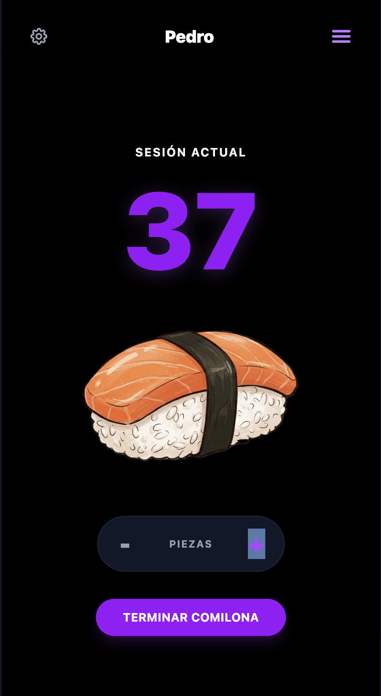

# 🍣 Sushi Tracker



**Sushi Tracker** es una Single Page Application (SPA) construida con React, enfocada en ofrecer una experiencia de usuario fluida y nativa (mobile-first) para registrar el consumo de sushi en tiempo real.

**[Prueba la aplicación en vivo aquí](https://pedromiras.github.io/sushi-tracker/dist/index.html)**

## Funcionalidades Destacadas

- **Experiencia Mobile-First & Dark Mode:** UI/UX cuidadosamente diseñada con Tailwind CSS, optimizada para interacciones táctiles y renderizada bajo un tema "Dark Premium".
- **Gestión de Estado Persistente:** Uso intensivo de `localStorage` para garantizar que las sesiones activas y el historial de consumo sobrevivan a recargas accidentales o cierres del navegador.
- **Modales Customizados:** Reemplazo de las alertas nativas (síncronas y bloqueantes) del navegador por modales construidos desde cero en React, gestionando la superposición de capas (Z-Index) y fondos desenfocados (backdrop-blur).
- **APIs Nativas Web:** Integración de la `Web Share API` del navegador para permitir a los usuarios compartir sus estadísticas de consumo directamente en sus redes sociales o aplicaciones de mensajería.

## Stack Tecnológico

- **Core:** React.js (inicializado con Vite para un *build* ultra rápido).
- **Estilado:** Tailwind CSS.
- **Iconografía:** SVGs puros e integrados para evitar peticiones HTTP adicionales.
- **Despliegue:** Integración continua básica y alojamiento estático en GitHub Pages.

## Retos Técnicos y Arquitectura

Este proyecto sirve como demostración práctica de conceptos fundamentales y optimizaciones en el ecosistema React:

1. **Optimización de Rendimiento (Performance):** Implementación de *Lazy Initialization* en los *Hooks* de estado (`useState`) para evitar accesos síncronos redundantes a la memoria del navegador durante el ciclo de vida de los componentes.
2. **Arquitectura de Componentes:** Uso del patrón *Lifting State Up* para propagar actualizaciones de estado hacia componentes padres y compartir información entre nodos hermanos de manera eficiente.
3. **Inmutabilidad:** Mutación segura de estructuras de datos (Arrays y Objetos) en el estado de React utilizando el *Spread Operator*.
4. **Clean Code & Documentación:** Aplicación de estándares de documentación **JSDoc** para tipar de forma implícita, estructurar y describir la lógica de negocio.

## Instalación Local

Si deseas clonar y auditar el código en tu entorno de desarrollo local:

```bash
# 1. Clonar el repositorio (Asegúrate de cambiar TU_USUARIO si es necesario)
git clone [https://github.com/PEDROMIRAS/TU_REPOSITORIO.git](https://github.com/PEDROMIRAS/TU_REPOSITORIO.git)

# 2. Navegar al directorio del proyecto
cd sushi-tracker

# 3. Instalar las dependencias de Node
npm install

# 4. Iniciar el servidor de Vite
npm run dev

